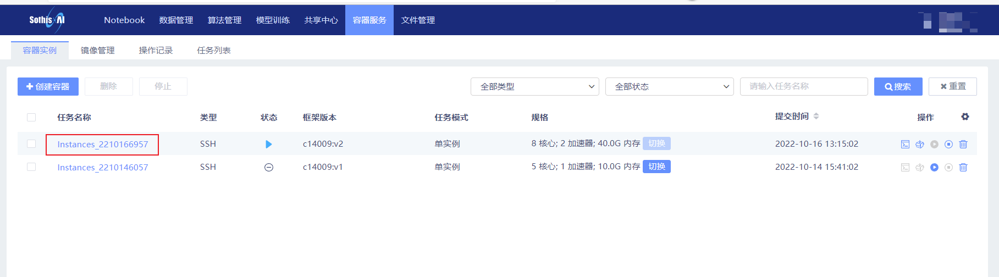
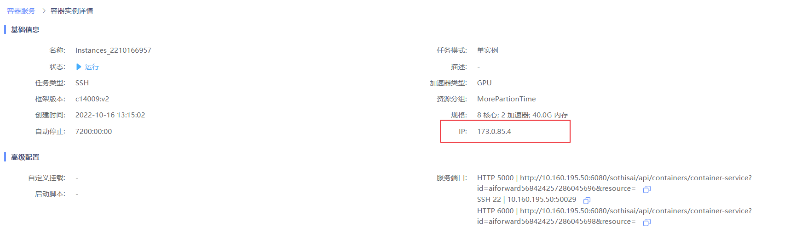
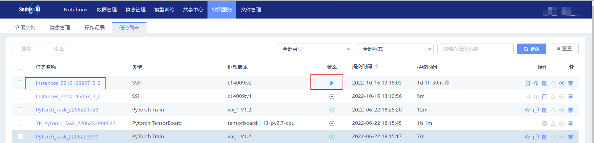
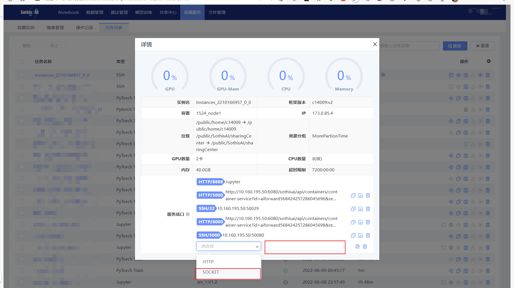
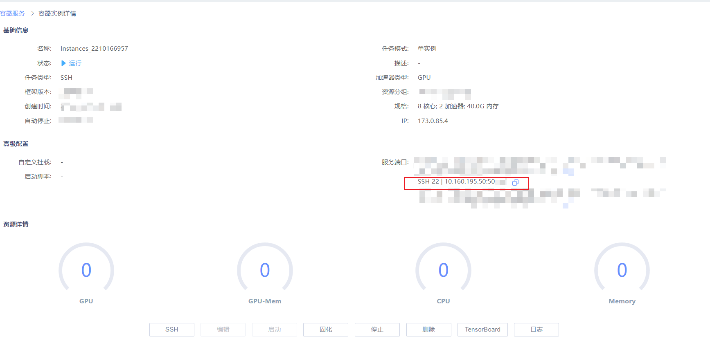

# 如何外部直接链接到容器内部
## 使用ssh二次跳转
通过配置ssh下的config文件，使得ssh的proxyjump命令进行跳转。
因此推荐能使用ssh/config 来直接链接的编程工具，如vscode，vim，nvim，emacs等。
示例代码：
```shell
Host SothisAI #跳转机名称，自定义
  HostName 10.160.195.50 #固定ip
  User xxx #登录用户名
Host SothisAI_container #目标机名称，自定义
  HostName xxx.xxx.xxx.xxx #容器ip地址
  User xxx #登录用户名
  ProxyJump SothisAI #与跳转机名称相同
```
1. 容器IP获取


2. 登录名与登陆密码
> **跳转机和容器**的登录密码都是使用者的**登录平台的密码**，用户名也是相同。

## 使用容器对外暴露的端口直接登录

容器内容默认的ssh端口为22，外部服务器端口池目前开启了100个端口。
开启方式：
1. 任务列表里确认要开启端口的容器/notebook任务。


2. 点击**任务名**，下拉找到**+**号添加端口，选择socket模式，端口根据您容器内的ssh配置进行选择，默认ssh配置请填写22。
之后等待即可


3. 根据分配的ip:port，在各个远程访问软件/编辑器/IDE中配置一下即可以使用。
> 注意，因为端口池只是小规模开放，存在因为端口池资源被用完而导致**无资源可用**，此时只能等待其他用户使用完并释放资源。
