# 模型训练教程

​		模型训练模块支持训练、调优、推理三种任务。

## 1训练任务

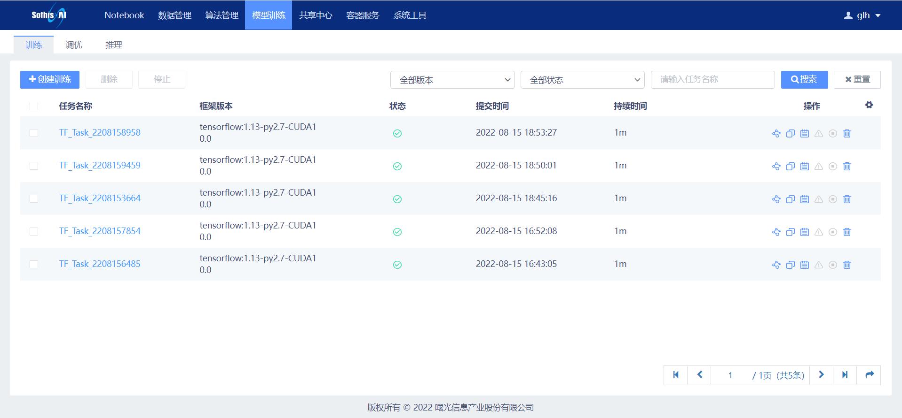

​		训练任务主页面显示已经创建过的训练任务，分为“任务名称”、“框架版本”、“状态”、“提交时间”、“持续时间”和“操作”六列：

​		**框架版本：** 表示使用的镜像版本；

​		**任务名称：** 表示创建的训练任务名称且不允许重复；

​		**状态：** 表示当前任务的状态，有以下6种：“等待”表示训练任务已创建成功，正在等待计算资源，“部署”表示正在部署执行训练的环境，“运行”表示训练任务正在运行，“停止”表示训练任务终止，“完成”表示训练任务已经完成，“失败”表示训练任务执行失败；

​		**提交时间：** 表示训练任务的创建时间；

​		**持续时间：** 表示训练任务的运行时长；

​		**操作：** 表示的是可进行的操作，可以进行“推理”、“克隆”、“日志”、“原因”、“停止”和“删除”。

### 1.2查询任务

​		训练任务主页面可输入查询条件对任务进行精确查询，可单独或综合使用“镜像版本”、“任务状态”和“任务名称”（该查询条件支持模糊查询）作为查询条件；点击“搜索”按钮，根据查询条件查询任务记录；点击“重置”按钮，清空查询条件。

### 1.3创建任务

​		点击“创建训练”，选择框架。

#### 1.3.1TensorFlow任务

​		训练任务的提交方式支持分布式提交、非分布式提交两种提交方式。

##### 1.3.1.1提交分布式任务
<!-- 这里需要补充一个案例 -->

​		**任务名：** 表示该任务的名称且不允许重复；

​		**Python代码：** 表示训练所需要的 python程序的路径地址，支持手动输入、集群文件选取、和本地文件上传等三种输入方式，可以点击“预览”按钮预览选中的python程序。

​		**Python参数：** 表示python代码所需要的参数；（选填）

​		**工作空间：** 表示python程序执行时所在的工作目录，可以通过右边的文件夹浏览按钮选择工作空间的地址；

​		**TB日志路径：** 表示用于TensoBoard的日志文件输出目录，可以通过右边的文件夹浏览按钮选择生成日志所在的文件夹；（选填）

​		**环境变量：** 表示训练过程中所需要的环境变量，可以通过右边的文件浏览按钮、文件上传按钮进行环境变量文件的集群选取和本地上传；（选填）

​		**任务类型：** 表示训练任务的提交方式，提交分布式任务选中“分布式”；

​		**实现方式：** 表示分布式的种类，分为PS-worker分布式和Horovod分布式两种方式；

​		**加速器类型：** 表示训练任务的加速器类型；

​		**框架版本：** 表示用来进行训练的TensorF1ow镜像版本；

​		**资源分组：** 表示训练任务使用的资源分组（默认以GPU型号作为分组）；

​		**Parameter Server：** 表示参数服务器节点的数量；

​		**Worker：** 表示工作节点的数量；

​		**CPU数量：** 表示一个PS 或 Worker占用的CPU数量；
 
​		**GPU数量：** 表示一个PS 或 Worker占用的GPU数量；

​		**内存：** 表示一个Worker 占用的内存大小；

​		**超时限制：** 表示该TensorF1ow训练任务所需要的最长运行时间。

​		输入相关参数，点击“运行”按钮进入训练任务的详情页面。

<!-- 只有一个tf1的案例缺少tf2的方案-->

​		【注意】在PS-worker分布式任务中Parameter Server只使用CPU资源，不占用GPU。对于TensorF1ow的分布式代码，需要按照以下规则对参数进行设置：

​		tf.flags.DEFINE_string(job_name', ", 'One of "ps" , "worker","".Empty for local training')

​		tf.flags.DEFINE_string('ps_hosts', " , 'Comma-separated list of target hosts')

​		tf.flags.DEFINE_string('worker_hosts', ",'Comma-separated list of target hosts')

​		tf.flags.DEFINE_integer('task_index', 0, 'Index of task within the job')

###### 1.3.1.1.1创建数据集
<!-- 咋用，感觉还需要案例完善 -->

​		点击“创建数据集”按钮，开启新的标签页通过WebShell访问数据集容器，在操作窗口执行创建数据集命令；

​		【注意】首次访问数据集容器时将会创建一个TF _Dataset，任务（长服务），可在Task List 中查看TF_Dataset任务信息。

###### 1.3.1.1.2选取集群文件

​		以“Python Code”为例：
​		点击文件浏览按钮弹出文件选择器，在文件选择器中选中需要使用python代码文件"mnist_dist.py”，点击“确认”按钮确认完成文件选取。

###### 1.3.1.1.3上传本地文件
<!-- 上传文件部分有点问题，是否要表明路径以及引入的数据集 -->

​		以“Python Code”为例：
​		点击文件上传按钮弹出文件选择器，在文件选择器中选中需要使用的 python代码文件“mnist_dist.py”，点击“打开”按钮开始上传文件，文件上传成功后输入框自动填充文件保存目录。
**【注意】Python Code只支持上传以“.py”为后缀的文件，文件大小超过20MB建议使用WinSCP上传；ENV只支持上传小于10KB的文件。**
<!-- 这里需要特殊标记 -->

###### 1.3.1.1.4预览Python代码

​		在Python代码输入框中填写 python代码所在的地址（也可通过文件集群选取或本地上传进行自动填充）后，点击预览按钮预览python 代码。

##### 1.3.1.2提交非分布式任务

​		创建非分布式TensorFlow训练任务提交相对简单，左侧参数与分布式任务完全相同。右侧参数包括：

​		**任务类型：** 表示训练任务的提交方式，提交非分布式任务选中“非分布式”；

​		**加速器类型：** 表示训练任务的加速器类型；

​		**框架版本：** 表示用来进行训练的TensorF1ow镜像版本；

​		**资源分组：** 表示训练任务使用的资源分组（默认以GPU型号作为分组）；

​		**CPU数量：** 表示训练任务占用占用的CPU数量；

​		**GPU数量：** 表示训练任务占用占用的GPU数量；

​		**内存：** 表示训练任务占用占用的内存大小；

​		**超时限制：** 表示该TensorFlow训练任务所需要的最长运行时间。

​		输入相关参数，点击“运行”按钮进入训练任务的详情页面。

#### 1.3.2PyTorch任务
<!-- 有些多余，和tensorflow部分重复 -->

​		训练任务的提交方式支持分布式提交、非分布式提交两种提交方式。

##### 1.3.2.1提交分布式任务

​		**任务名：** 表示该任务的名称且不允许重复；

​		**Python代码：** 表示训练所需要的 python程序的路径地址，支持手动输入、集群文件选取、和本地文件上传等三种输入方式，可以点击“预览”按钮预览选中的python程序。

​		**Python参数：** 表示python代码所需要的参数；（选填）

​		**工作空间：** 表示python程序执行时所在的工作目录，可以通过右边的文件夹浏览按钮选择工作空间的地址；

​		**TB日志路径：** 表示用于TensoBoard的日志文件输出目录，可以通过右边的文件夹浏览按钮选择生成日志所在的文件夹；（选填）

​		**环境变量：** 表示训练过程中所需要的环境变量，可以通过右边的文件浏览按钮、文件上传按钮进行环境变量文件的集群选取和本地上传；（选填）

​		**任务类型：** 表示训练任务的提交方式，提交分布式任务选中“分布式”；

​		**实现方式：** 表示分布式的种类，分为standard分布式和Horovod分布式两种方式；

​		**加速器类型：** 表示训练任务的加速器类型；

​		**框架版本：** 表示用来进行训练的PyTorch镜像版本；

​		**资源分组：** 表示训练任务使用的资源分组（默认以GPU型号作为分组）；

​		**Worker：** 表示工作节点的数量，单击“Worker”后面的箭头可以对单个Worker作资源配置；
 
​		**CPU数量：** 表示一个Worker占用的CPU数量；

​		**GPU数量：** 表示一个Worker占用的GPU数量；

​		**内存：** 表示一个Worker 占用的内存大小；

​		**超时限制：** 表示该PyTorch训练任务所需要的最长运行时间。

​		输入相关参数，点击“运行”按钮进入训练任务的详情页面。

​		**【注意】在分布式任务中，SothisAI只支持TCP连接模式。对于PyTorch的分布式代码，需要按照以下规则对参数进行设置：**
<!-- tcp连接的教程是否要放一个 -->
<!-- 感觉最好还是基于pytorch的分布式来处理，而不是参数模式 -->

​		parser.add_argument('--rank', type=int, help=Rank of the current process.')

​		parser.add_argument(--world-size',type=int, help=Number of processes participating in the job.')

​		parser.add_argument("--ip', type=str, default=127.0.0.1', help='IP of the current rank 0.')

​		parser.add_argument('--port', type=str, default=20000', help=Port of the current rank 0.')

###### 1.3.2.1.1创建数据集

见1.3.1.1.1

###### 1.3.2.1.2选取集群文件

见1.3.1.1.2

###### 1.3.2.1.3上传本地文件

见1.3.1.1.3

###### 1.3.2.1.4预览Python代码

见1.3.1.1.4

##### 1.3.2.2提交非分布式任务

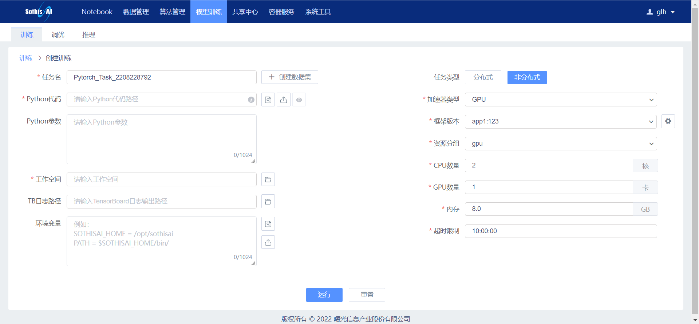

​	创建非分布式PyTorch训练任务提交相对简单，左侧参数与分布式任务完全相同。右侧参数包括：

​		**任务类型：** 表示训练任务的提交方式，提交非分布式任务选中“非分布式”；

​		**加速器类型：** 表示训练任务的加速器类型；

​		**框架版本：** 表示用来进行训练的PyTorch镜像版本；

​		**资源分组：** 表示训练任务使用的资源分组（默认以GPU型号作为分组）；

​		**CPU数量：** 表示训练任务占用占用的CPU数量；

​		**GPU数量：** 表示训练任务占用占用的GPU数量；

​		**内存：** 表示训练任务占用占用的内存大小；

​		**超时限制：** 表示该PyTorch训练任务所需要的最长运行时间。

​		输入相关参数，点击“运行”按钮进入训练任务的详情页面。

### 1.4查看任务详情

​		在训练任务主页面，点击列表中“名称”列中对应的任务名称可以进入任务的详情页面。

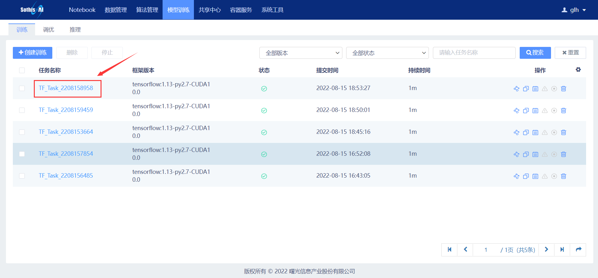

#### 1.4.1TensorFlow框架任务详情

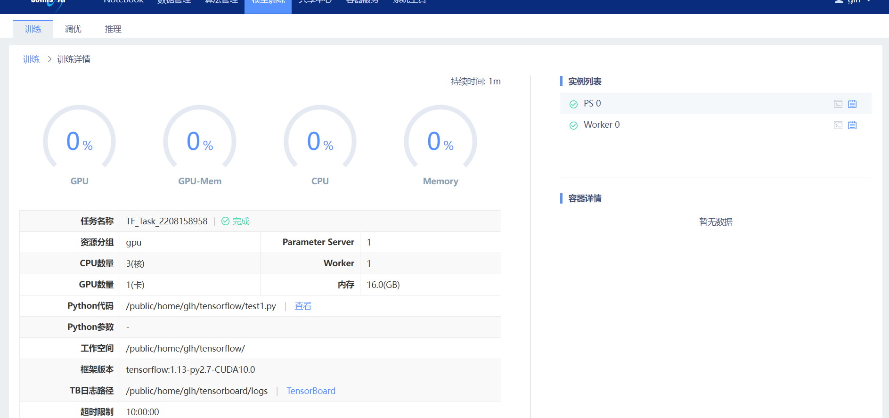

​		训练详情页面包含了：

​		 **任务资源监控信息**：包括“GPU”、“GPU-Mem”、“CPU”和“Memory”的平均利用率；

​		 **任务参数信息**：包括“任务名”、“Parameter Server”、“Worker”、“资源分组”、“GPU数量”、“CPU数量”、“内存”、“Python代码”、“Python参数”、“工作空间”、“框架版本”、“TB日志路径”、“超时限制”、“环境变量”的值；

​		 **任务状态**：“等待”表示训练任务已创建成功，正在等待计算资源；“部署”表示训练任务已获取计算资源，正在部署实例；“运行”表示训练任务正在运行；“停止”表示训练任务终止；“完成”表示训练任务已经完成；“失败”表示训练任务执行失败；

​		 **持续时间**：表示训练任务当前的运行时长；

​		 **实例列表**：任务创建的实例列表，分为“实例状态”、“实例名称”、“SSH”、“日志”；
**
​		 **容器详情**：容器详细信息。

##### 1.4.1.1查看容器详情

​		点击“实例列表”中实例所在行，即可在“容器详情”中显示该实例容器的详细信息。

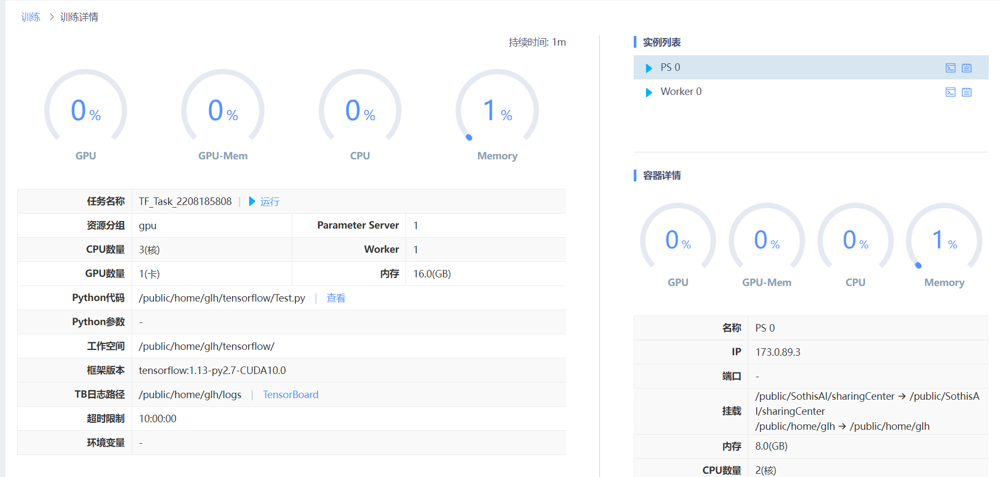

##### 容器详情：

​		**容器资源监控信息：** 包括“GPU”、“GPU-Mem”、“CPU”和“Memory”的利用率；

​		**名字：** 实例名称；

​		**IP：** 容器IP；

​		**端口：** 容器服务端口；

​		**挂载：** 容器挂载目录信息；

​		**内存：** 容器内存大小

​		**CPU数量：** 容器CPU数量；

​		**GPU数量：** 容器GPU数量。

##### 1.4.1.2SSH访问容器

​		点击运行状态下实例对应行的“SSH”按钮，打开新的标签页，通过 WebShell访问该实例对应的容器。

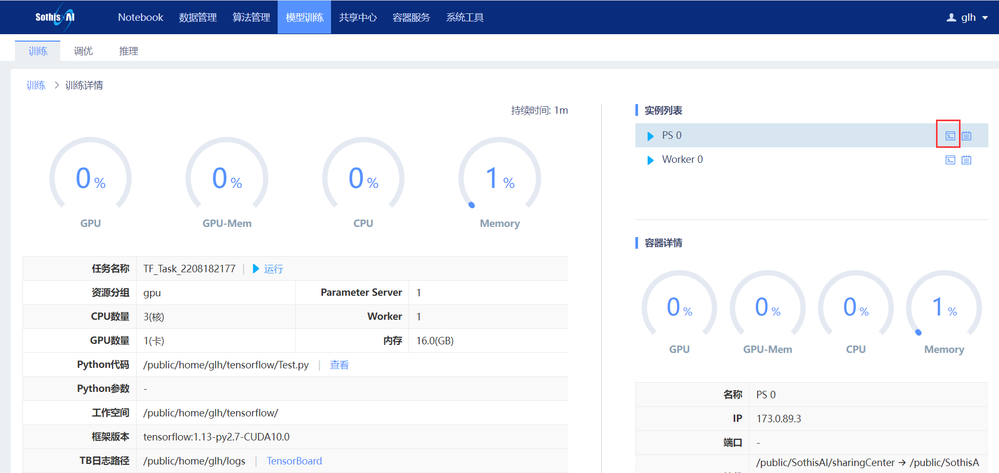

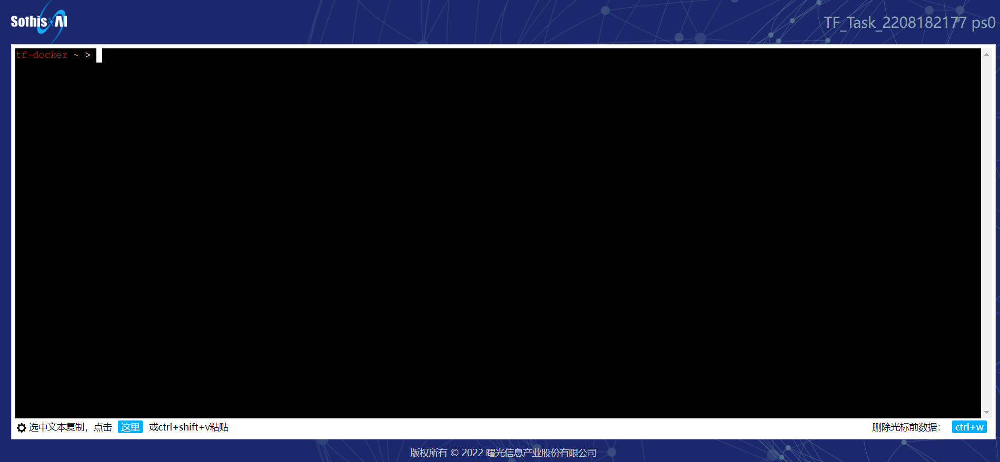

##### 1.4.1.3查看容器日志

​		点击实例对应行的“日志”按钮，查看该实例的容器日志。

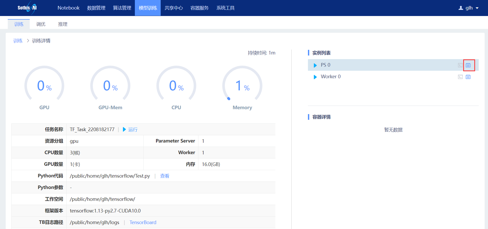

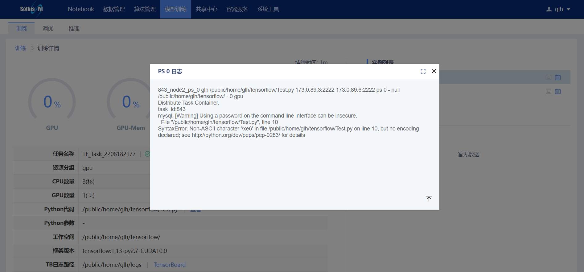

##### 1.4.1.4访问TensorBoard服务

​		当“TB日志路径”不为空时，在任务详情页该字段右侧存在“TensorBoard”按钮，点击“TensorBoard”按钮将会打开新的标签页访问TensorBoard服务。

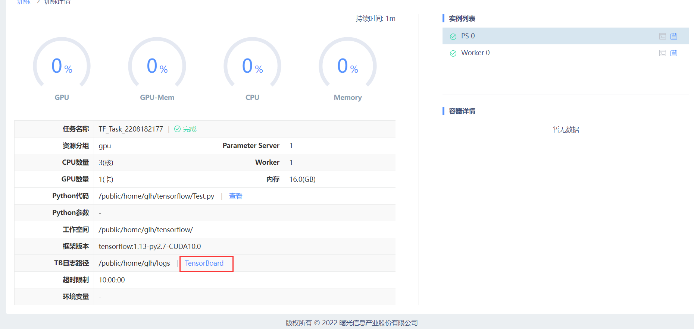

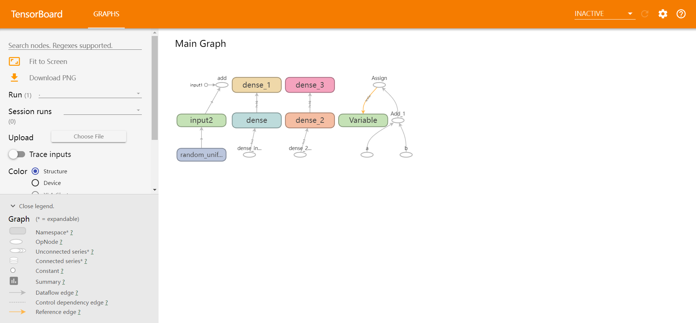

​		【注意】访问TensorBoard，服务时若该TensorFlow任务未关联TensorBoard，任务将会创建一个与该TensorFlow任务关联的TensorBoad任务（长服务），可在Task List中查看TensorBoard任务信息。

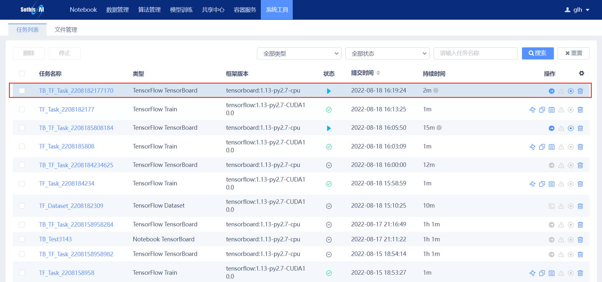

#### 1.4.2PyTorch框架任务详情

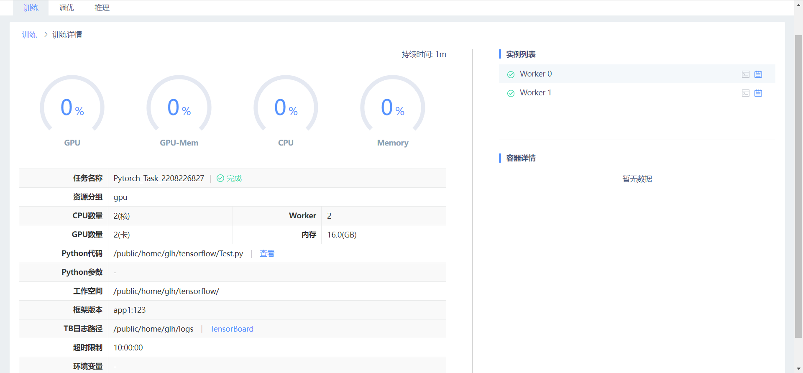

​	训练详情页面包含了：

​		1)任务资源监控信息：包括“GPU”、“GPU-Mem”、“CPU”和“Memory”的平均利用率；

​		2)任务参数信息：包括“任务名”、“Worker”、“资源分组”、“GPU数量”、“CPU数量”、“内存”、“Python代码”、“Python参数”、“工作空间”、“框架版本”、“TB日志路径”、“超时限制”、“环境变量”的值；

​		3)任务状态：“等待”表示训练任务已创建成功，正在等待计算资源；“部署”表示训练任务已获取计算资源，正在部署实例；“运行”表示训练任务正在运行；“停止”表示训练任务终止；“完成”表示训练任务已经完成；“失败”表示训练任务执行失败；

​		4)持续时间：表示训练任务当前的运行时长；

​		5)实例列表：任务创建的实例列表，分为“实例状态”、“实例名称”、“SSH”、“日志”；

​		6)容器详情：容器详细信息。

##### 1.4.2.1查看容器详情

​	见1.4.1.1

##### 1.4.2.2SSH访问容器

​	见1.4.1.2

##### 1.4.2.3查看容器日志

​	见1.4.1.3

##### 1.4.2.4访问TensorBoard服务

​	见1.4.1.4

### 1.5克隆任务

​		点击任务对应行的“克隆”按钮，复制此任务参数创建新的训练任务，支持重新调整任务参数。

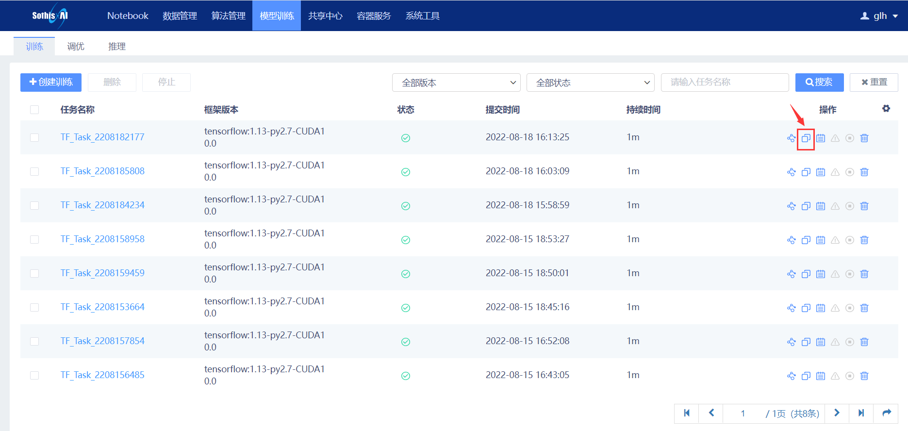

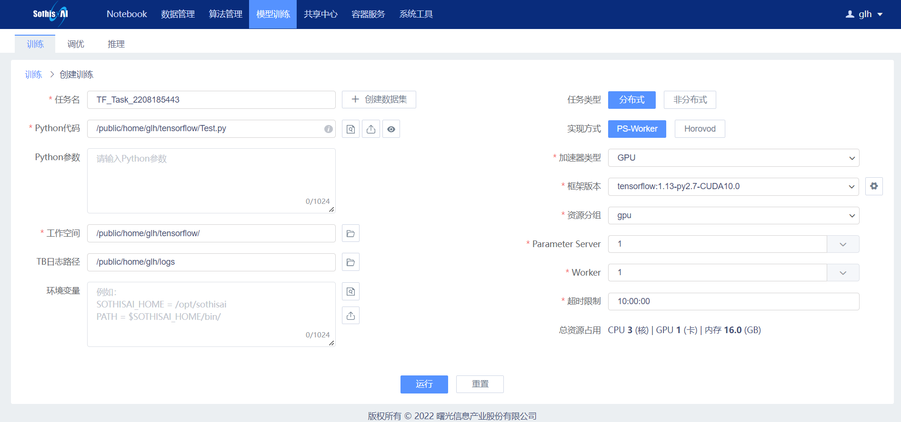

### 1.6查看任务日志

​		点击任务对应行的“日志”按钮，查看任务运行日志。

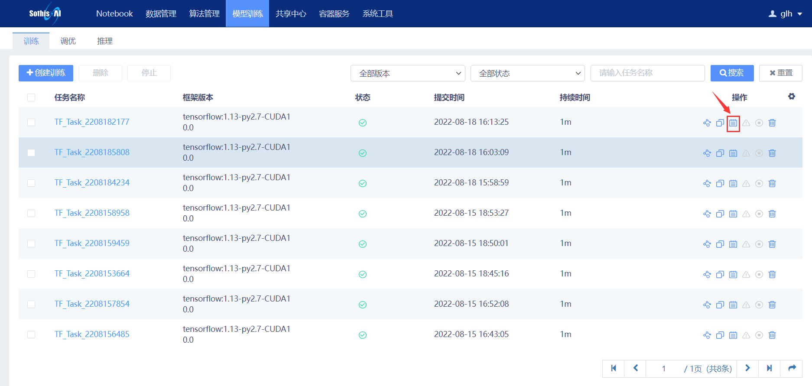

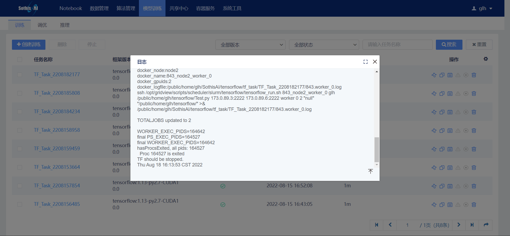

### 1.7查看任务异常原因

​		点击任务（任务处于异常状态：长时间等待或任务失败）对应行的“原因”按钮，查看任务的具体异常信息。

**待**

**待**

**待**

### 1.8停止任务

​		单个停止：点击任务（状态为等待、部署或运行）对应行的“停止”按钮，弹出确认提示框后，点击“是”按钮，停止此任务。

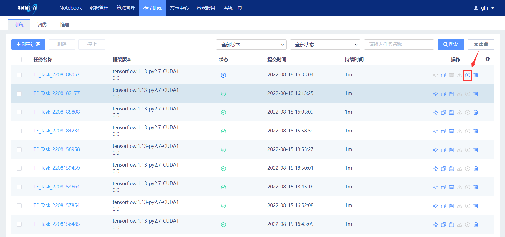

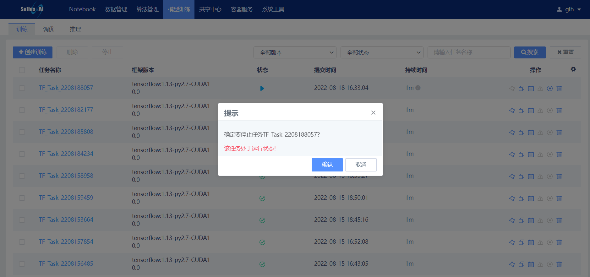

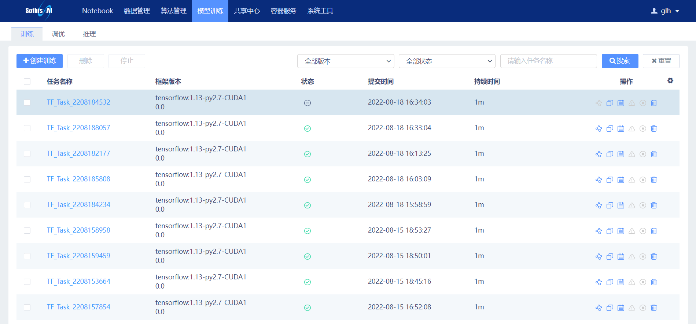

​		批量停止：点击任务对应行的复选框选中多个任务，点击列表上方“停止”按钮，弹出确认提示框后，点击“是”按钮，停止多个任务。

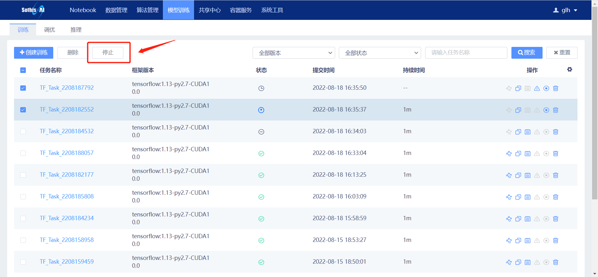

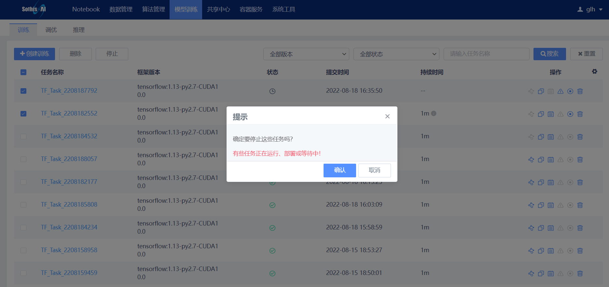

### 1.9删除任务

​		单个删除：点击任务对应行的“删除”按钮，弹出确认提示框后，点击“是”按钮，删除此任务。		

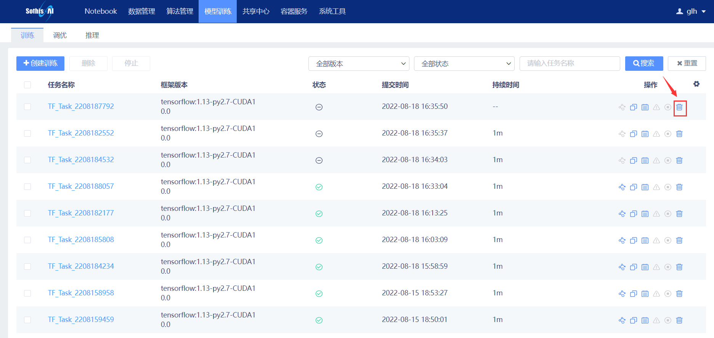

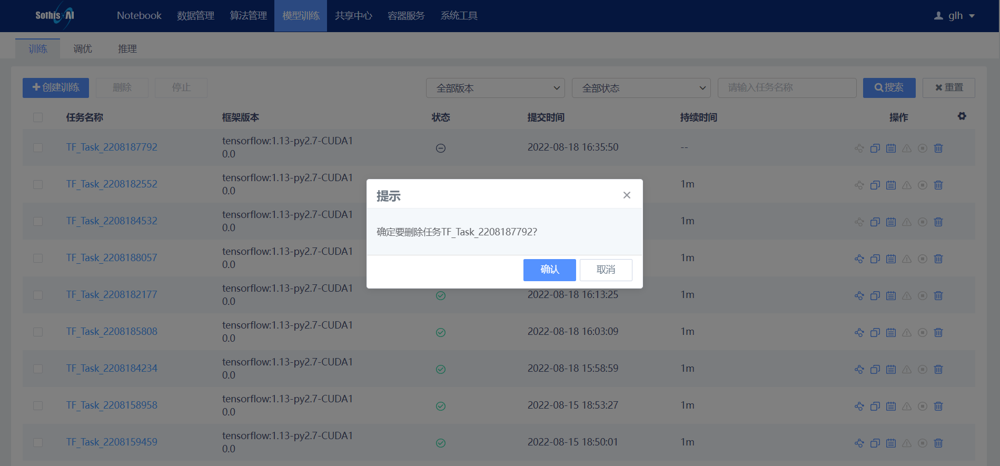

​		批量删除：点击任务对应行的复选框选中多个任务，点击列表上方“删除”按钮，弹出确认提示框后，点击“是”按钮，删除多个任务。

## 2调优任务
<!-- 不应该叫做调优任务,应该是模型微调 -->

​		点击“调优”标签页按钮，访问调优任务管理页面。

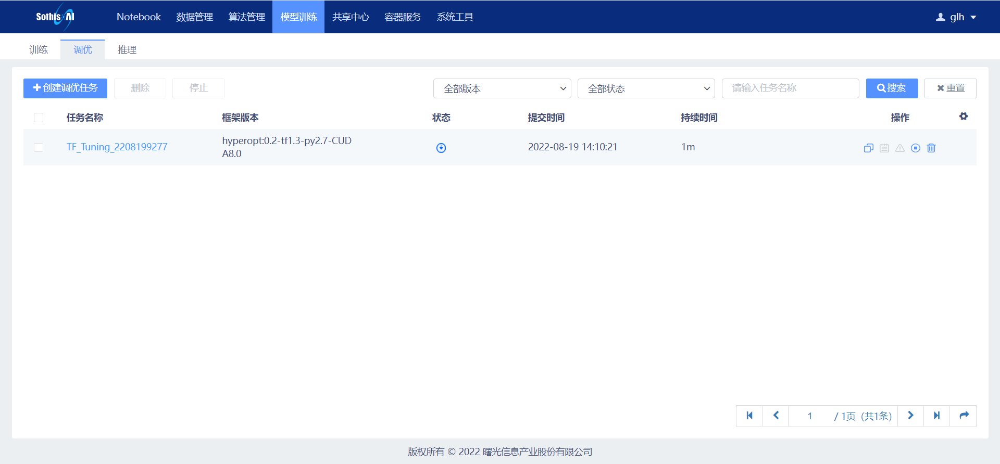

​		调优任务主页面显示已经创建过的调优任务，分为“任务名称”、“框架版本”、“状态”、“提交时间”、“持续时间”和“操作”六列：

​		**名称：**表示创建的调优任务名称且不允许重复；

​		**镜像版本：**表示使用的镜像版本；

​		**状态：**表示当前任务的状态，有以下6种：“等待”表示训练任务已创建成功，正在等待计算资源，“部署”表示正在部署执行训练的环境，“运行”表示训练任务正在运行，“停止”表示训练任务终止，“完成”表示训练任务已经完成，“失败”表示训练任务执行失败；

​		**提交时间：**表示调优任务的创建时间；

​		**持续时间：**表示调优任务的运行时长；

​		**操作：**表示的是可进行的操作，可以进行“克隆”、“日志”、“原因”、“停止”和“删除”。

### 2.1查询任务

​		调优任务主页面可输入查询条件对任务进行精确查询，可单独或综合使用“镜像版本”、“任务状态”和“任务名称”（该查询条件支持模糊查询）作为查询条件；点击“搜索”按钮，根据查询条件查询任务记录；点击“重置”按钮，清空查询条件。

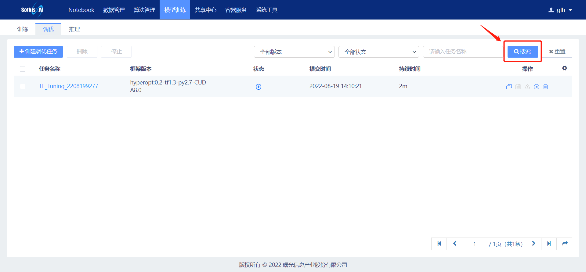

### 2.2创建任务

​		点击“创建调优任务”进入调优任务创建页面，调优任务以分布式的方式执行，Master负责发布、统计迭代次数和数据记录，Worker用于具体执行调优任务。

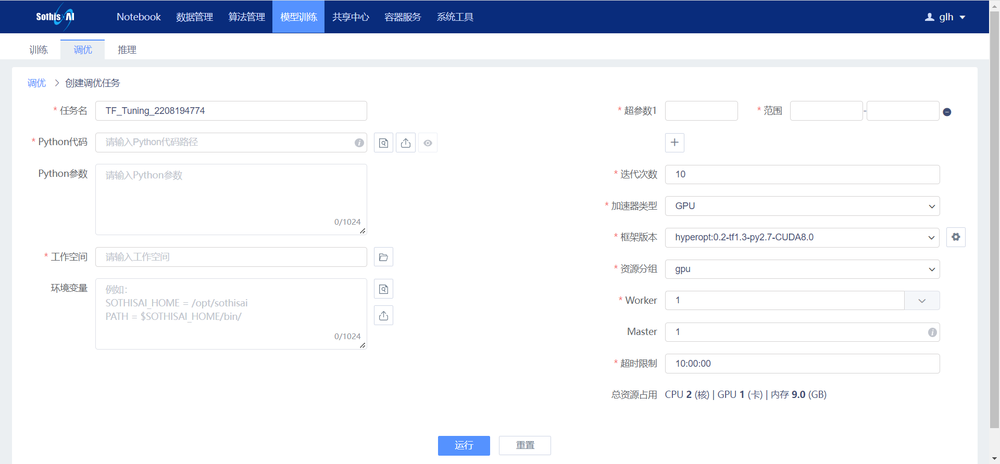

​		创建分布式训练任务时的所需参数包括：

​		**任务名：** 表示该任务的名称且不允许重复；

​		**Python代码：** 表示调优任务所需要的python程序的路径地址，支持手动输入、集群文件选取、和本地文件上传等三种输入方式，可以点击“预览”按钮预览选中的python程序；

​		**Python参数：** 表示python代码所需要的参数；（选填）

​		**工作空间：** 表示 python程序执行时所在的工作目录，可以通过右边的文件夹浏览按钮选择工作空间的地址；

​		**环境变量：** 表示调优任务执行过程中所需要的环境变量，可以通过右边的文件浏览按钮、文件上传按钮进行环境变量文件的集群选取和本地上传；（选填）

​		**超参数名称：** 表示调优任务需要查找的最优超参数；（最多支持5个超参数同时查找）

​		**超参数范围：** 表示对应超参数的取值范围；

​		**迭代次数：** 表示该训练任务的迭代次数；

​		**加速器类型：** 表示训练任务的加速器类型；

​		**框架版本：** 表示用来进行调优任务的镜像版本；

​		**资源分组：** 表示训练任务使用的资源分组（默认以GPU型号作为分组）；

​		**Worker：** 表示工作节点的数量；

​		**Master：** 表示负责发布、统计迭代次数和数据记录的管理节点数量；（默认为1）

​		**超时限制：** 表示该训练任务所需要的最长运行时间。
 
​		**CPU数量：** 表示一个PS或Worker占用的CPU数量；

​		**GPU 数量：** 表示一个PS或Worker占用的GPU数量；

​		**内存：** 表示一个 Worker占用的内存大小；

​		【注意】Master 默认节点数量为1，资源使用CPU数量默认为1、内存默认为1G，Worker的资源使用用户可根据实际情况自由分配。调优代码需要遵循以下规则：

​		1）使用命令行参数定义要优化的超参数

​				Eg:tf.app.flags.DEFINEamet float('learning_rate',0.1,"Name of hyperparameter")

​		2）打印 tuning_loss的值，用于评估超参数最佳值

​				Eg: print("tuning_loss:%og" %(loss))

### 2.3查看任务详情

​		在任务主页面，点击列表中“名称”列中对应的任务名称可以进入任务的详情页面。

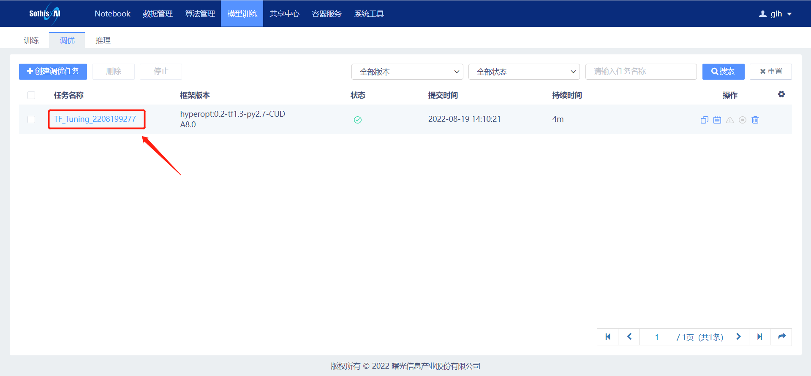

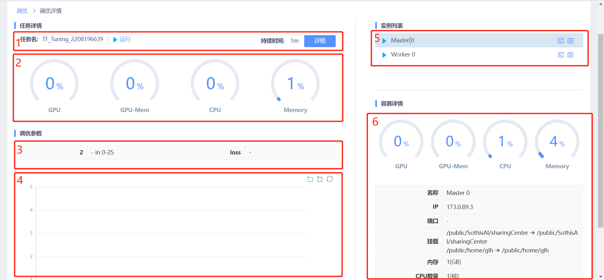

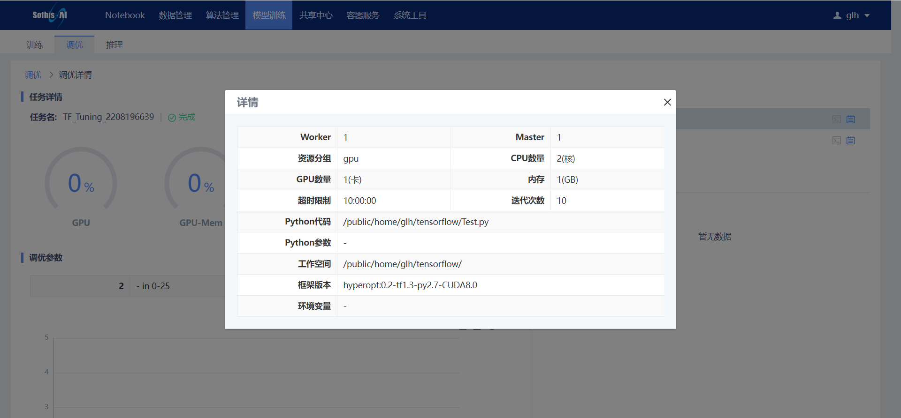

​		调优详情页面包含了：

​		1）任务信息：包括“任务名称”、“任务状态”、“任务持续时间”和“任务详细参数”；点击“详情”按钮查看任务详细参数。

​		2）任务资源监控信息：包括“GPU”、“GPU-Mem”、“CPU”和“Memory”的平均利用率；

​		3）调优参数信息：包括“超参数名称”、“超参数最优值”、“超参数取值范围”、“loss最优值”；

​		4）任务迭代记录：以折线图的形式展示迭代过程 loss值的变化曲线，可详细查看每次迭代超参数的取值情况；

​		5）实例列表：任务创建的实例列表，分为“实例状态”、“实例名称”、“SSH”、“日志”。

​		6）容器详情：容器详细信息。

### 2.4克隆任务

​		点击调优任务对应行的“克隆”按钮，复制此任务参数创建新的调优任务，支持重新调整任务参数。

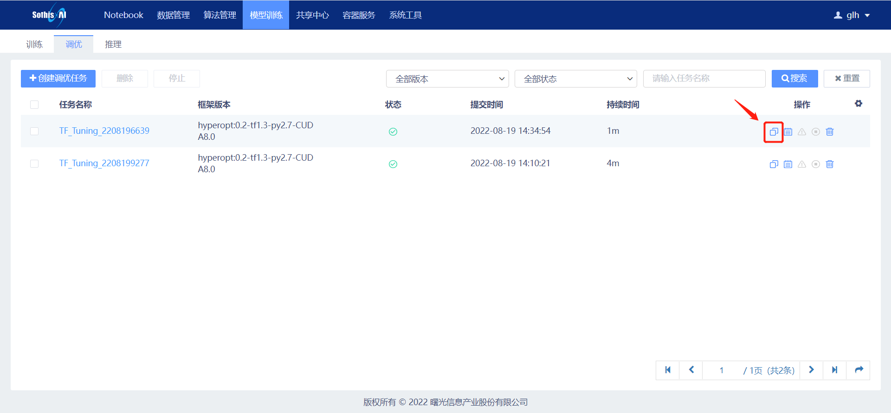

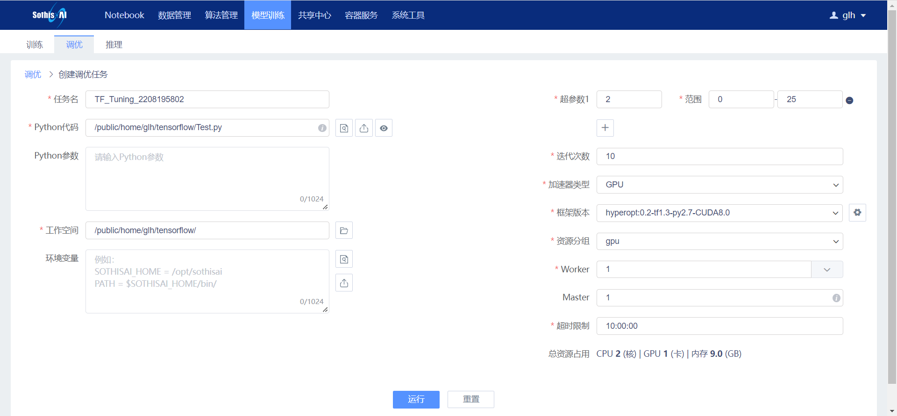

### 2.5查看任务日志

​		点击调优任务对应行的“日志”按钮，查看调优任务运行日志。

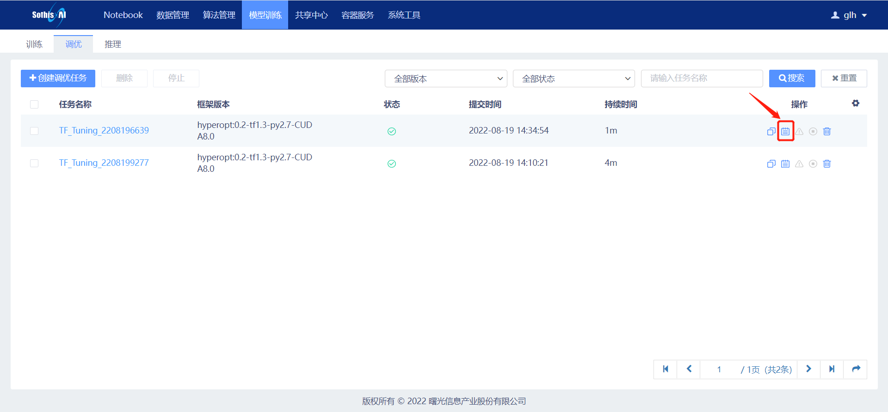

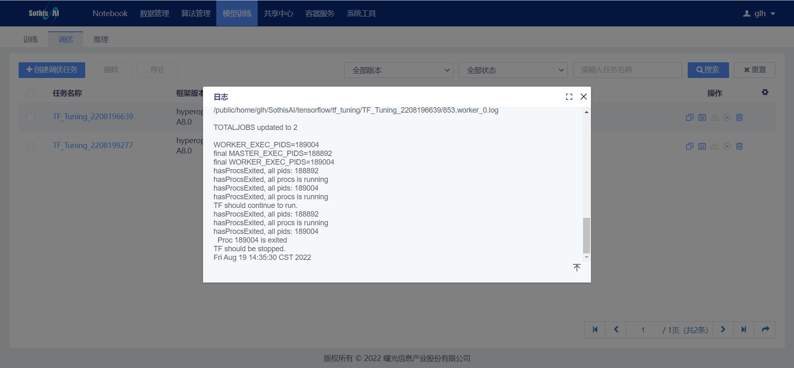

### 2.6查看任务异常原因

​		点击任务（任务处于异常状态：长时间等待或任务失败）对应行的“原因”按钮，查看任务的具体异常信息。

**待**

**待**

**待**

### 2.7停止任务

​		单个停止：点击任务（状态为等待、部署或运行）对应行的“停止”按钮，弹出确认提示框后，点击“是”按钮，停止此任务。

ng)

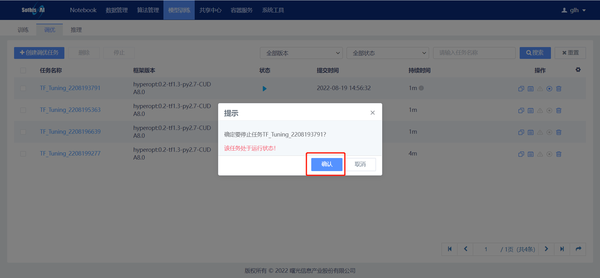

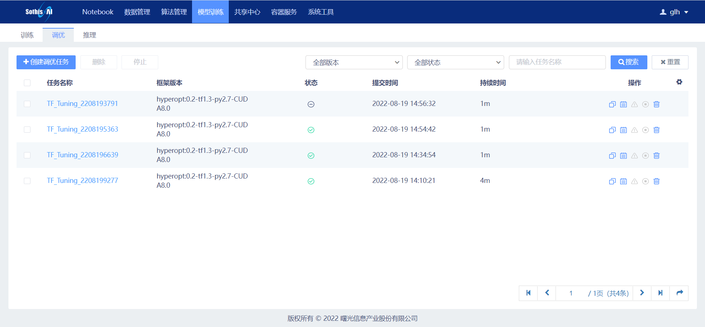

​		批量停止：点击任务对应行的复选框选中多个任务，点击列表上方“停止”按钮，弹出确认提示框后，点击“是”按钮，停止多个任务。

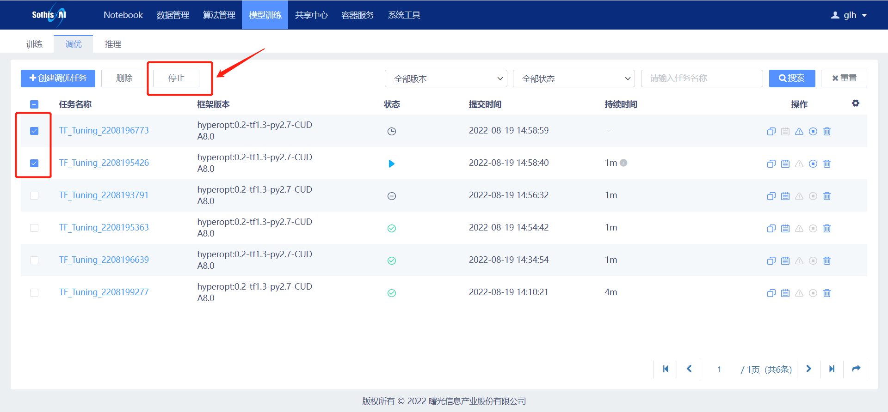

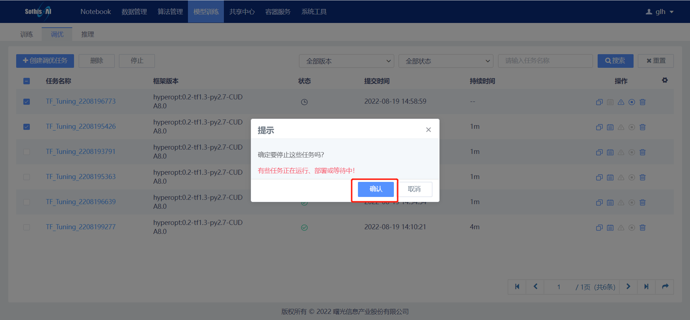

### 2.8删除任务

​	单个删除：点击任务对应行的“删除”按钮，弹出确认提示框后，点击“是”按钮，删除此任务。	

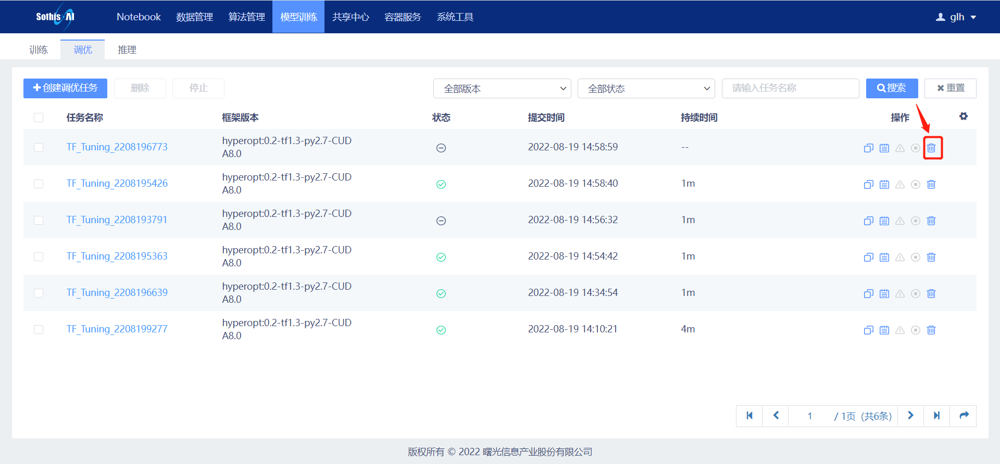

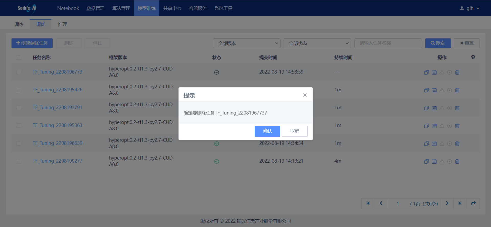

​		批量删除：点击任务对应行的复选框选中多个任务，点击列表上方“删除”按钮，弹出确认提示框后，点击“是”按钮，删除多个任务。

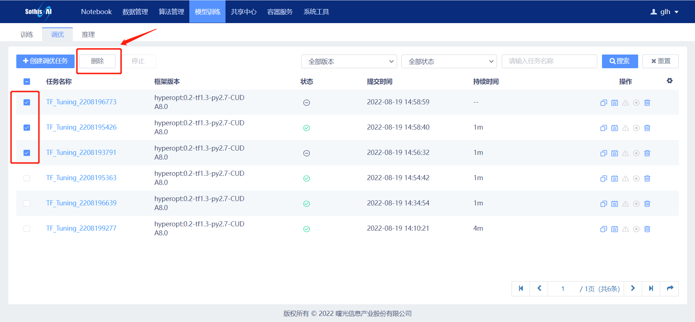

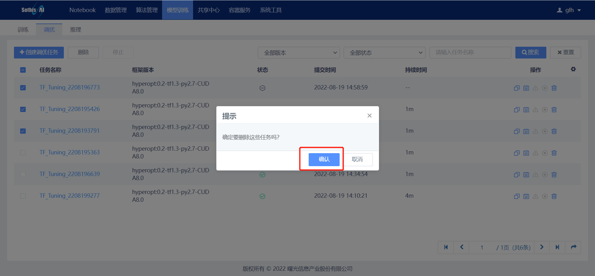

## 3推理任务
<!-- 推理任务部分根据实际例子来写吧 -->

### 创建推理任务

​		创建推理任务有以下两个入口:
​		(1)对于已完成的训练任务可以点击对应行的“推理”按钮进行推理任务创建页面;

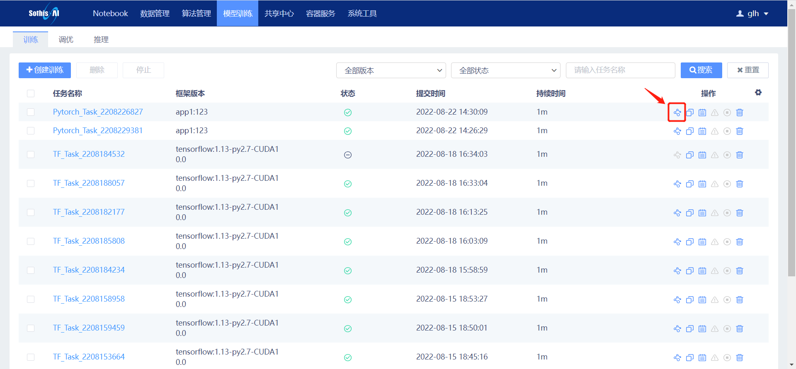

​		(2)点击“推理”标签页按钮进入推理任务创建页面。
<!-- 
#### 生成脚本模板

#### 浏览文件

#### 撤销脚本内容

#### 保存脚本

#### 全屏显示脚本

### 查看推理结果

#### 查看单张图像分类推理结果

#### 查看批量图像分类推理结果

#### 查看目标检测推理结果

#### 查看语义分割推理结果 -->