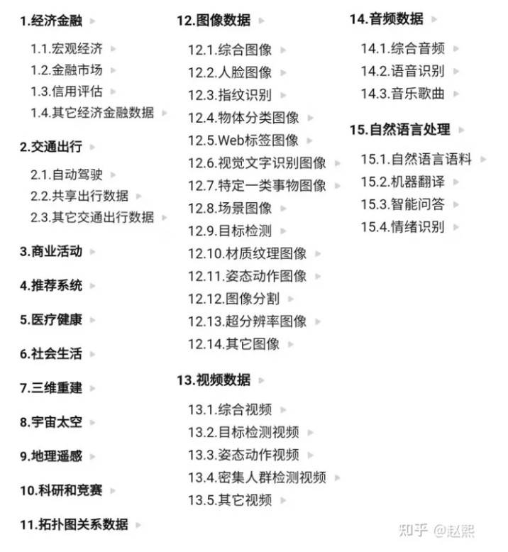

# 关于数据集的预先配置

这部分只是列出一些数据集链接，如果您想查询如何上传自己的数据集/分享数据集,请访问[平台使用教程](/docs/SothisAI/UsePlatform.md/#21数据集)

由于数据集数量过于庞大，且每位用户所使用的数据集都有不同，因此我们只本地存一些最常用的数据集如**imagenet**之类，并在此展示一些所收集到的数据集的链接。如果您希望您科研/教学想要使用的数据集预装载在平台上，请见[人员联系](/docs/README.md/)

> 下面所列的只是一些所搜集到的数据集，如果您有别的数据集链接想分享，可以提交issue。

## cv方向数据集
1. [pytorchg官方数据集](https://pytorch.org/vision/0.13/datasets.html)

2. [ImageNet-C/ImageNet-P](https://github.com/hendrycks/robustness)

3. [ImageNet-A](https://github.com/hendrycks/robustness)

## nlp 方向数据集
1. [pytorchg官方数据集](https://pytorch.org/text/stable/datasets.html)

## 医学方向数据集
1. [医学图像方面的数据集 集合](https://github.com/sfikas/medical-imaging-datasets)

## 综合链接
1. [tensorflow官方数据集](https://tensorflow.google.cn/datasets/catalog/overview)

2. [网上公开数据集](https://zhuanlan.zhihu.com/p/25138563)

3. [2019年收集的公开数据集网站 链接](https://zhuanlan.zhihu.com/p/55775309)
